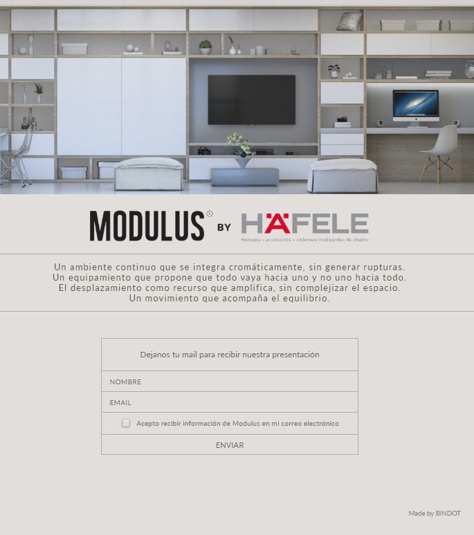

# Landing page con form para suscripción
Una landing page muy simple, con la intención de mostrar un proyecto del cliente y ofrecer un newsletter para recibir más información.

[Ver online!](https://adperossa.github.io/modulus-mailing/)

## Descripción
Uno de los primeros proyectos que realicé, el cliente necesitaba una página muy simple para mostrar en un evento ofreciendo la posibilidad de dejar su email para recibir más información. Era importante que fuera estéticamente agradable al verse en una tablet. El layout es fluido y responsivo.

Se utilizó HTML5 (para validación básica del form), CSS y Jquery para el manejo de AJAX.
Los datos se envían a un script en PHP muy usado (PHPMailer) el cual fue adaptado para armar el email según los requerimientos, enviando un panfleto PDF como adjunto.